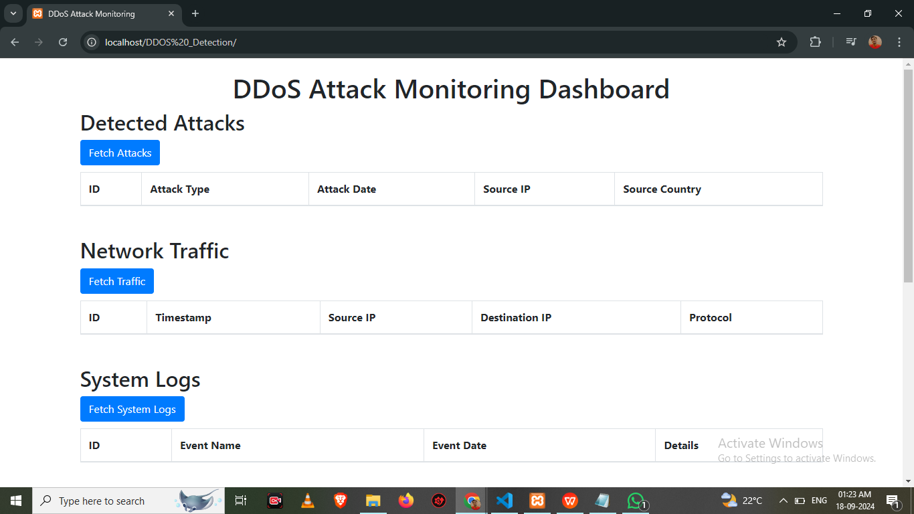
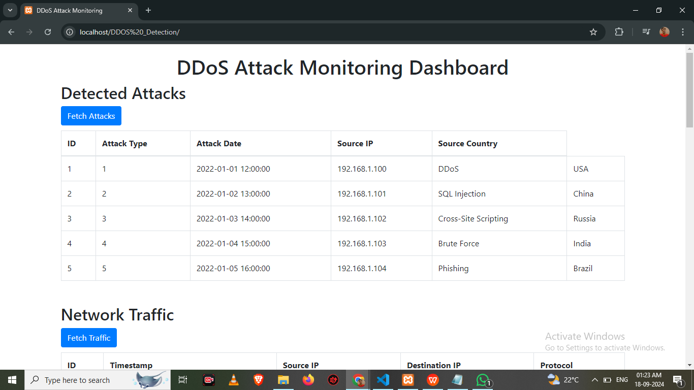
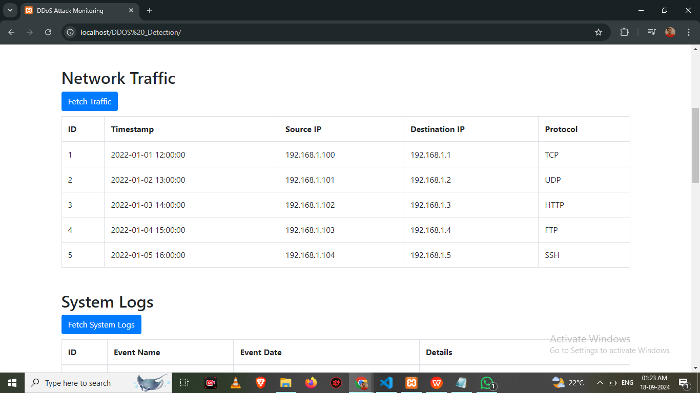
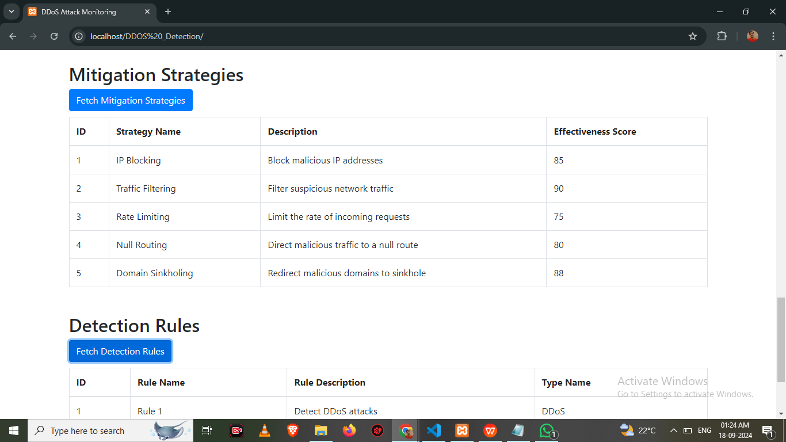

# DDoS-Attack-Detection
# Pratik_Bagade
# PROJECT: Distributed Denial of Service Attacks in MySQL Database Project Based on Real-time Scenario

Distributed Denial-of-Service (DDoS) attack is a type of cyberattack where an attacker attempts to make a computer or network resource unavailable by overwhelming it with traffic from multiple sources. This is typically done by using a network of compromised devices (bots) to flood the targeted system with traffic, causing it to become overwhelmed and unable to handle legitimate requests.

## How a DDoS Attack Works

1. **Botnet creation**: An attacker creates a network of compromised devices (bots) by infecting them with malware.
2. **Traffic generation**: The attacker instructs the bots to send traffic to the targeted system, such as a website or network.
3. **Traffic flood**: The bots flood the targeted system with traffic, overwhelming its capacity to handle requests.
4. **System overload**: The targeted system becomes overwhelmed, causing it to slow down or become unavailable.

## Types of DDoS Attacks

1. **Volume-based attacks**: Overwhelming the targeted system with a large amount of traffic.
2. **Protocol attacks**: Exploiting weaknesses in network protocols to consume system resources.
3. **Application attacks**: Targeting specific applications or services to consume resources.

## Techniques Used in DDoS Attacks

1. **Botnets**: Networks of compromised devices used to launch attacks.
2. **Malware**: Software designed to harm or exploit systems.
3. **Scripting**: Using scripts to automate attack processes.
4. **Amplification attacks**: Using third-party services to amplify traffic.

## Protection Against DDoS Attacks

Organizations can use the following measures to protect against DDoS attacks:

1. **Firewalls**: To block malicious traffic.
2. **Intrusion Detection/Prevention Systems (IDS/IPS)**: To detect and prevent attacks.
3. **Load balancing**: To distribute traffic across multiple resources.
4. **Content Delivery Networks (CDNs)**: To cache content and reduce server load.
5. **DDoS mitigation services**: Specialized services to detect and mitigate DDoS attacks.

## Database Structure

### Databases

1. **Database 1**: Attack_Detection
2. **Database 2**: Network_Traffic
3. **Database 3**: System_Logging
4. **Database 4**: Botnet_Information
5. **Database 5**: Mitigation_Strategies

### Database 1: Attack_Detection

- **Tables**:
  1. **attacks**
  2. **attack_types**
  3. **sources**
  4. **detection_rules**
  5. **alerts**

- **Table Structures**:
  - **Attacks**: (id, attack_type, attack_date, source_ip)
  - **Attack_types**: (id, type_name, description)
  - **Sources**: (id, source_ip, source_country)
  - **Detection_rules**: (id, rule_name, rule_description)
  - **Alerts**: (id, attack_id, alert_date, alert_level)

## Images

- **Img1**: 
- **Img2**: 
- **Img3**: 
- **Img4**: 
- **Img5**: 
